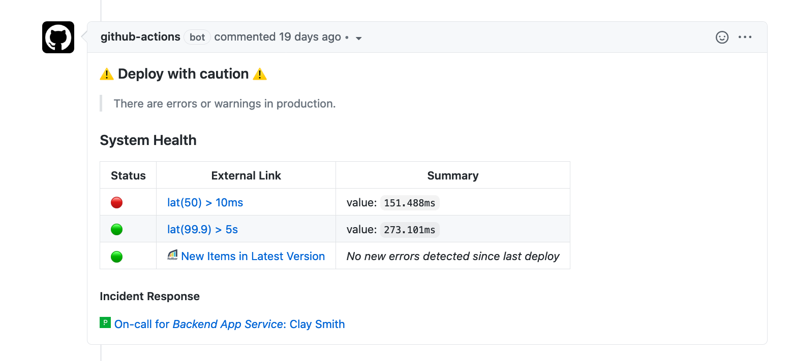

# lightstep-action-predeploy

The `lightstep/lightstep-action-predeploy` action provides insight into the health of production service(s) during software delivery alongside on-call and error information. 

This Javascript-based action can be used when a pull request is approved by GitHub reviewers and uses APIs to provide a summary of deployment risk ahead of a code change going to a production environment.

:book: [Follow the tutorial on setting up this action on Lightstep's Documentation Portal](https://docs.lightstep.com/paths/git-hub-action-path)



## Requirements

### GitHub
  * Repository that corresponds to a service running in a production environment
    * Github action workflow for the repository that uses the Lightstep GitHub action
    * API token(s) defined as secrets in the repository configuration settings
    * `.lightstep.yml` configuration file in root directory of repository

### Lightstep
  * Instrumented service(s) running in a production environment
    * Deployment tracking configured for the service
    * Streams created for instrumented service
    * Alert threshold(s) defined for streams
    * Lightstep [public API key](https://docs.lightstep.com/docs/create-and-manage-api-keys)

## Usage

This action can be run on `ubuntu-latest` GitHub Actions runner as a step in any GitHub Action workflow.

Most users will also want to specify a list of specific conditions to check in the `lightstep.yml` file (see example below).

### Example Workflow

This workflow uses the action to add a comment to a pull request after a review has been submitted.

👉 *[Try out this workflow on your repository](https://lightstep.github.io/lightstep-action-predeploy/)*

#### `.github/workflows/predeploy.yml`

```yaml
on:
  pull_request_review:
    types: [submitted]

jobs:
  deploy_check_job:
    runs-on: ubuntu-latest
    name: Verify Pre-Deploy Status

    steps:  
      # Using checkout is required if reading from a `.lightstep.yml` file in the repo
      - name: Checkout
        uses: actions/checkout@v2

      # Run checks and output status as PR comment
      - name: Lightstep Pre-Deploy Check
        id: lightstep-predeploy
        uses: lightstep/lightstep-action-predeploy
        env:
          GITHUB_TOKEN: ${{ secrets.GITHUB_TOKEN }}
        with:
          lightstep_api_key: ${{ secrets.LIGHTSTEP_API_KEY }}
          pagerduty_api_token: ${{ secrets.PAGERDUTY_API_TOKEN }}
          rollbar_api_token: ${{ secrets.ROLLBAR_API_TOKEN }}
```

### Additional Examples

A fully working example is available in the [hipster-shop](https://github.com/lightstep/hipster-shop) repository.

## Inputs

Inputs can be specified using any combination of a `.lightstep.yml` file in the root of the repository using the action, as inputs to the action, as environment varables.

API keys are always passed as inputs or environment variables.

The following are **required**:

| Action Input             | `.lightstep.yml`| Env var                   |
| ------------------------ | --------------- | ------------------------- |
| `lightstep_organization` | `organization`  | `LIGHTSTEP_ORGANIZATION`  |
| `lightstep_project`      | `project`       | `LIGHTSTEP_PROJECT`       |
| `lightstep_api_key`      | N/A             | `LIGHTSTEP_API_KEY`       |

Additional inputs (_optional_):

| Action Input         | `.lightstep.yml`  | Env var                |
| -------------------- | ----------------- | ---------------------- | 
| `pagerduty_api_token`| N/A               | `PAGERDUTY_API_TOKEN`  |
| `rollbar_api_token`  | N/A               | `ROLLBAR_API_TOKEN`    |
| `rollup_conditions`  | N/A               | N/A                    |

`rollup_conditions` will collapse all conditions to a single row of the output table if set to `true`.

## `.lightstep.yml` Configuration

This action reads configuration from a special file you add to the root of your repository.

Here's an example `.lightstep.yml` file that specifies PagerDuty and Rollbar-specific configuration: 

Optionally, you can specify a list of condition ids to check status of the project with. The default behavior is to check *all* conditions on the project.

```yaml
organization: -13ac9ef7
project: hipster-shop

# optional - specifiy specific conditions to check
conditions:
  - YfDzWxGL
  - gLFxv0B1

# optional integrations
integrations:
  rollbar:
    environment: production
    account: lightstep
    project: hipster-shop
  pagerduty:
    service: PA0B3RR
```

## Outputs

* `lightstep_organization` - Lightstep organization associated with an account

* `lightstep_project` - Lightstep project associated with an organization

* `lightstep_predeploy_md` - Markdown-formatted summary of pre-deploy checks

* `lightstep_predeploy_status` - Status of pre-deploy checks: `ok`, `warn`, `error` or `unknown`

## Notes

This action does not automatically generate a pull request comment after running.

To add the output of this action to generate a pull request comment, use the `lightstep_predeploy_md` output with another action like [`unsplash/comment-on-pr`](https://github.com/unsplash/comment-on-pr/).

## License

Apache License 2.0
